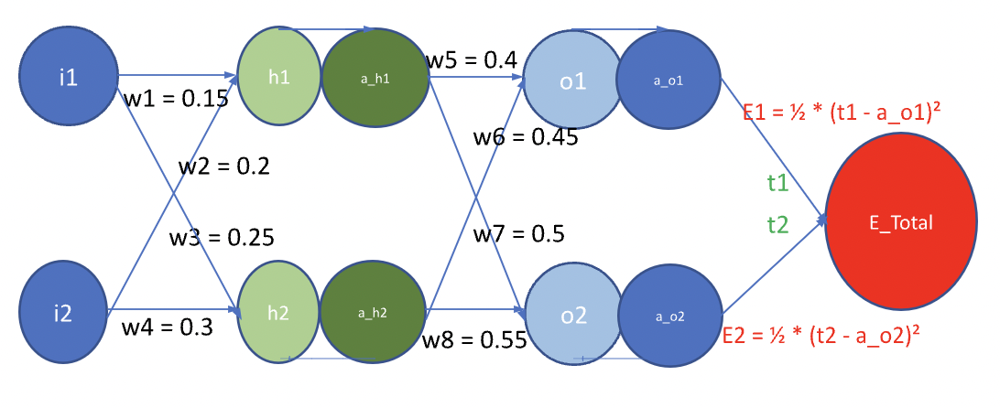
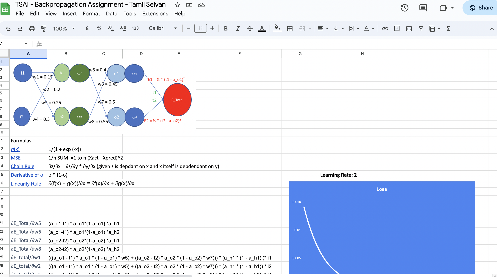
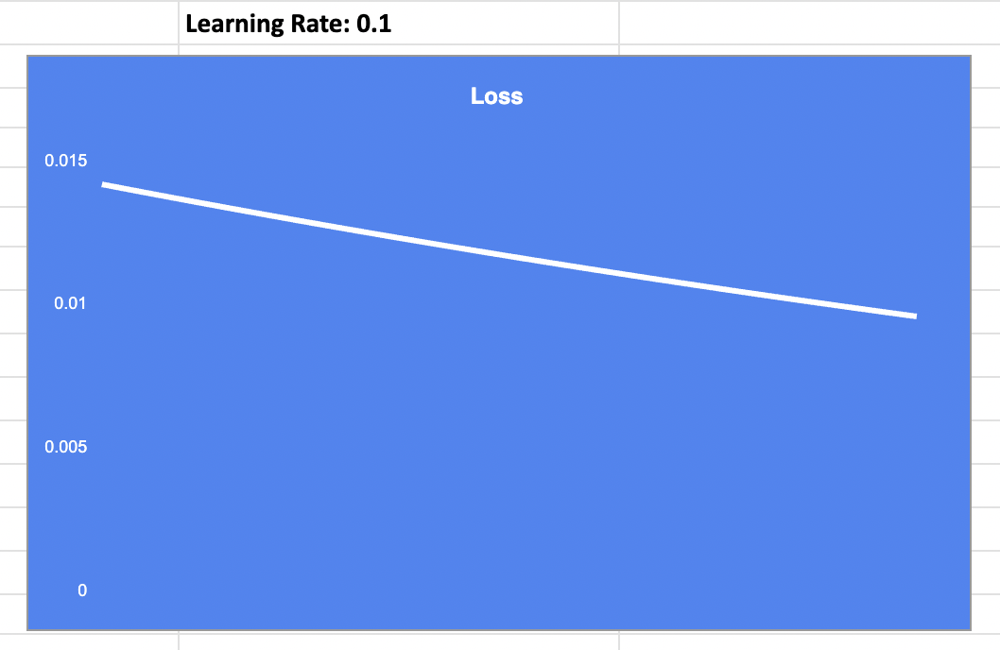
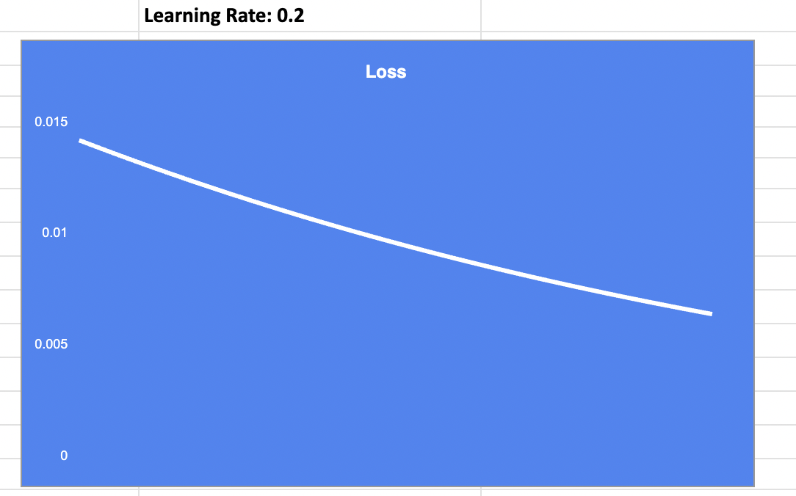
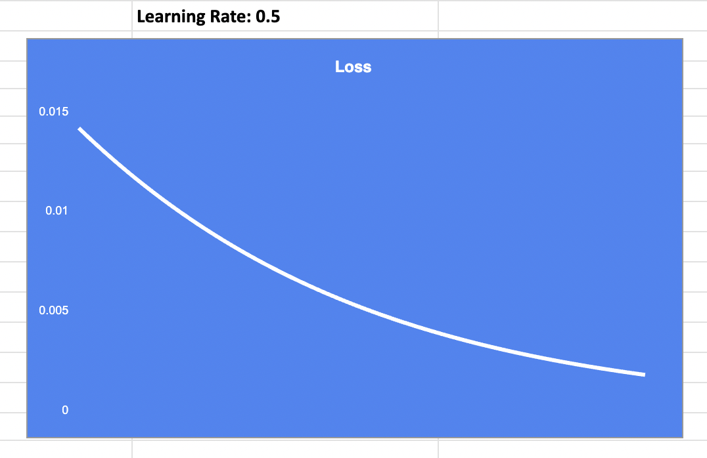
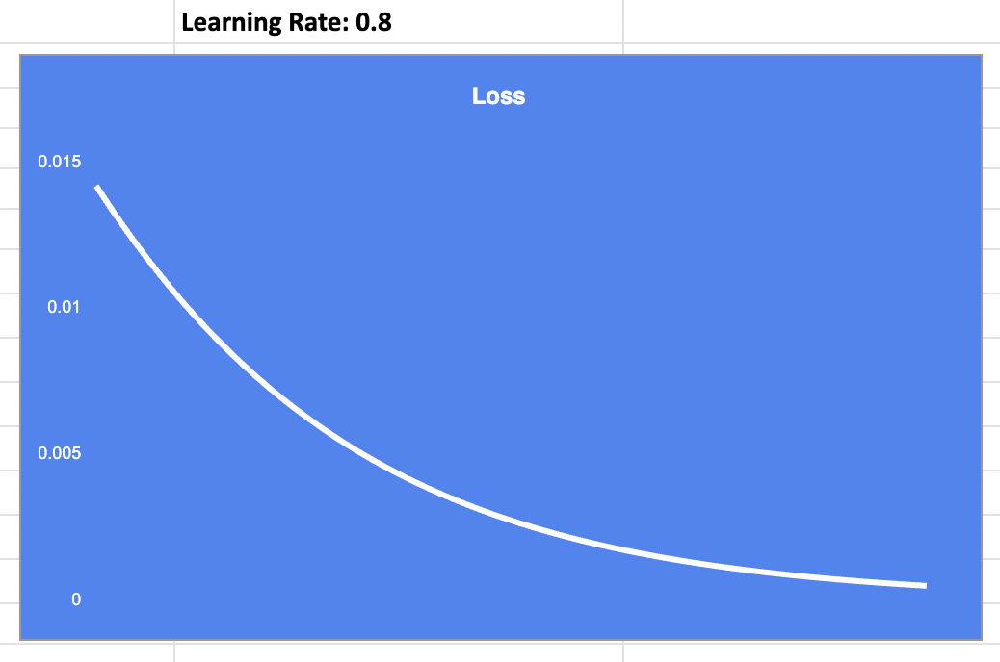
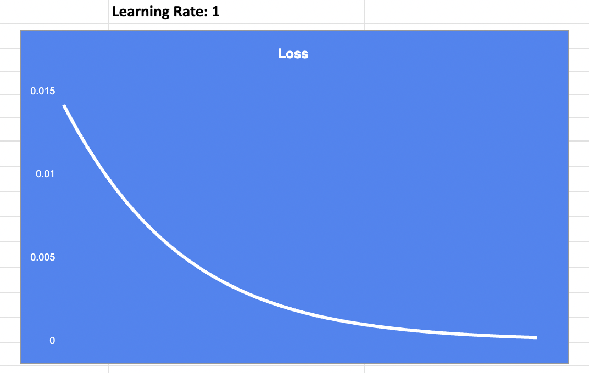
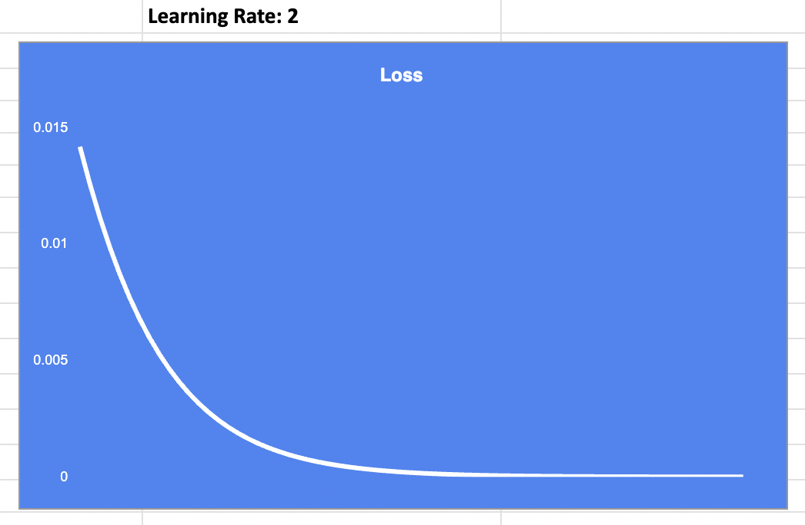

# S6: Back Propagation Assignment

## Back Propagation

Backpropagation computes the gradient in weight space of a feedforward neural network, with respect to a loss function $\frac{\partial Etotal}{\partial Wi} $. It is an iterative process of computing gradient one layer at a time from last. Backpropagation is part of the learning algorithm that also includes applying of computed gradient (Ex: SGD) [[wiki]](https://en.wikipedia.org/wiki/Backpropagation)

> The term backpropagation strictly refers only to the algorithm for computing the gradient, not how the gradient is used

## Learning Rate
In machine learning and statistics, the learning rate is a tuning parameter in an optimization algorithm that determines the step size at each iteration while moving toward a minimum of a loss function.[1] Since it influences to what extent newly acquired information overrides old information, it metaphorically represents the speed at which a machine learning model "learns".  
In setting a learning rate, there is a trade-off between the rate of convergence and overshooting. While the descent direction is usually determined from the gradient of the loss function, the learning rate determines how big a step is taken in that direction. A too high learning rate will make the learning jump over minima but a too low learning rate will either take too long to converge or get stuck in an undesirable local minimum. Learning rate can be adaptive. [[wiki]](https://en.wikipedia.org/wiki/Learning_rate)

## About the network

**Layers:** 3 (Input: 1, Hidden: 1 and Output: 1) 

**Weights:** 8 

**Inputs:** 2  

**Outputs:** 2

**Activation Function:** [Sigmoid](https://en.wikipedia.org/wiki/Sigmoid_function#:~:text=8%20External%20links-,Definition,refer%20to%20the%20same%20object.)

**Error Function:** [Mean Squared Error](https://en.wikipedia.org/wiki/Mean_squared_error)

## Back Propagation Document
[TSAI Backpropagation Assignment - Tamil Selvan](https://docs.google.com/spreadsheets/d/1GA_GmtCZ7NVgXPDtNhTgmYEpnT9lJ8MNiPwMx0Tyg8A/edit#gid=0)

## Important Formulas

1. [Sigmoid](https://en.wikipedia.org/wiki/Sigmoid_function) 
$$1/(1 + \mathrm{e}^{-x})$$
2. [MSE](https://en.wikipedia.org/wiki/Mean_squared_error) 
$$1/n \sum_{k=1}^n (a_k - a_k')^2$$
3. [Derivative of f = σ(x)](https://towardsdatascience.com/derivative-of-the-sigmoid-function-536880cf918e)
$$\mathrm{d}f/\mathrm{d}x = f \ast (1-f)$$
4. [Chain Rule](https://en.wikipedia.org/wiki/Chain_rule) 
$$∂z/∂x = ∂z/∂y \ast ∂y/∂x\;z \rightarrow x \rightarrow y$$
5. [Linearity Rule](https://en.wikipedia.org/wiki/Linearity_of_differentiation)
$$\partial(a \ast f(x) + b \ast g(x))/\partial{x} = a \ast \partial{f(x)}/\partial{x} + b \ast \partial{g(x)}/\partial{x}$$ 

## Outputs by Learning Rate

| LR      | Output |
| ----------- | ----------- |
| 0.1      |       |
| 0.2   |        |
| 0.5   |        |
| 0.8   |        |
| 1.0   |        |
| 2.0   |       |
