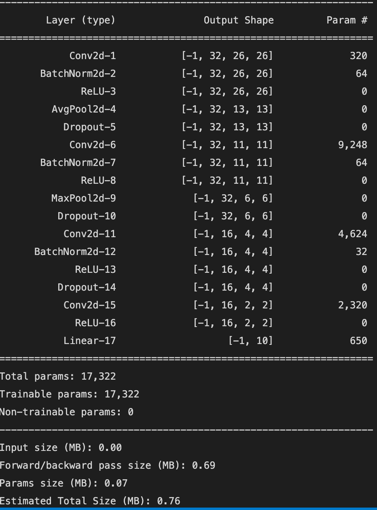

# tsai-bootcamp assignment S6

## The Problem
Predict Handwritten digits using NN with 99.4% Accuracy

## Dataset
[MNIST Dataset](https://www.kaggle.com/datasets/hojjatk/mnist-dataset)

| Training Data | Test Data |
| ------------- | ------------- |
| 60K  | 10K  |

## Dependencies

1. PyTorch - Base
2. Torchsummary - To review model summary
3. Torch Vision - For Transforms and datasets
4. pyplot (matplotlib) - Plotting
5. tqdm - Progress Bar

## Model

### Restrictions Applied:
1. No of Parameters must be < 20K
2. Not more than 20 Epochs

### Tuning
1. Tried with learning rates from 0.019, 0.0195, 0.0198, 0.02 (achieved 99.4), 0.021
2. Introduced maximum layers in first two convultions to keep a check on number of parameters and to predict edges & gradient better (as the job is preliminary to identify handwritten digits with very less noise)
3. Achieved receptive field of 26 [[link]](https://docs.google.com/spreadsheets/d/1W3uckDxoCBV2CHk0t1rzdoxKEFlXOPNzd5sAfsK8Slw/edit#gid=932103416) to make sure the last layer has seen the entire image
4. Used GAP in first convolution where the vision is too narrow
5. Used Max Pooling post layer 2 expecting edge and gradient detection to be successful already (also as a best practice it is better to keep MP and AP far away from the output layer)
6. Applied Batch Normalization in every layer except the last one
7. Used Relu as the activation function and applied it next to BN as per recommendation
8. Reduced the FC layer to 1 as the number of input channels is less than 150 (this has helped us to keep # of params in check)
9. Tried a model with only 3 Convolutions but the desired accuracy couldn't be reached
10. Applied dropouts at every convolution layer except the last (0.2,0.1,0.1)

## Training Data Preparation
1. Inputs are scaled down to 28*28
2. Random crop is applied on 10% of the input data set
3. Random Roation is applied
4. Images are standardized by converting them to Tensor (every rgb values are mapped bewteen 0-1 without affecting the magnitude)
5. Images are normalized to avoid contrast issues
6. Training data is shuffled to avoid false accuracy due to ordering
7. Batch size is maintained at 512

## Test Data Preparation
1. Only Standardization and Normalization are applicable

## Training Steps

Training of the model includes four important steps  
a. Predict  
b. Calculate Error  
c. Back Propagation [link](../BackPropagation.md)  
d. Optimize

The Model developed uses NLL as Loss Function [[1]](https://ljvmiranda921.github.io/notebook/2017/08/13/softmax-and-the-negative-log-likelihood/) [[2]](https://medium.com/deeplearningmadeeasy/negative-log-likelihood-6bd79b55d8b6)

`criterion = F.nll_loss`

The Model developed uses SGD as Optimizer [[1]](https://en.wikipedia.org/wiki/Stochastic_gradient_descent)

LR of the Model is set to `0.019` to achieve desired (99.4%) Accuracy

`optimizer = optim.SGD(model.parameters(), lr=0.0195, momentum=0.9)`

Note: It is important for us to reset gradients to zero for every mini batch to avoid accumulation of gradients [Reference](https://stackoverflow.com/a/48009142)
`optimizer.zero_grad()`

## Testing Steps
Testing/Validation is a simple process of iterating the test data set against the model. Since the test data set also is labelled we can calculate model's accuracy

## Results
Model Accuracy at 20 Epoch

 

